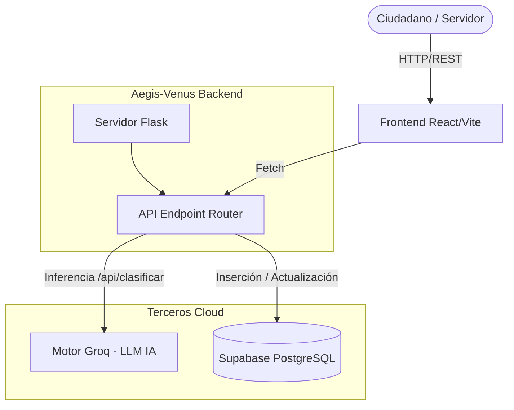

# Arquitectura del Sistema PQRSD Inteligente — Aegis-Venus

Este documento detalla la estructura lógica, el flujo de datos y la división de los directorios del proyecto, diseñado para la centralización y gestión inteligente de las PQRSDS mediante Inteligencia Artificial.

---

## 🏗️ 1. Diagrama de Alto Nivel (Vista Entorno)

El ecosistema se divide en dos macro-proyectos que interactúan únicamente a través de la red local HTTP (o vía CORS en producción):
1. **Frontend (Cliente):** React 18 + Vite (`localhost:8080`). Interacción gráfica de ciudadanos y funcionarios.
2. **Backend (Servidor):** Python 3 + Flask (`localhost:5001`). Punto único de control de lógica de negocios e IA.
3. **Persistencia de Datos:** PosgreSQL Cloud (Supabase).
4. **Motor de IA:** API externa Groq.

---

## 🎨 2. Frontend (React + Vite + TypeScript)

Basado en herramientas modernas para el rendimiento nativo del navegador, usando enrutamiento seguro mediante File-based Routes.

### Stack Tecnológico
- **Core:** React 18 / TypeScript
- **Bundler:** Vite
- **Routing:** Tanstack Router (Enrutamiento asíncrono y Typesafe).
- **Estilos:** TailwindCSS (Clases utilitarias) + variables CSS puras y Vanilla.
- **Notificaciones:** Sonner (Toast no obstructivo).
- **Animaciones:** Framer Motion.

### Estructura de Rutas y Navegación (`src/routes`)

| Ruta | Archivo | Descripción | Rol |
| :--- | :--- | :--- | :--- |
| `/` | `index.tsx` | Landing híbrido; permite "Consultar PQRSD" conectándose al endpoint `GET /radicado`. | Ciudadano |
| `/pqrsds` | `pqrsds.tsx` | Wizard (Formulario). Encadena el paso de `api/clasificar` con `api/casos` para crear PQRSDs. | Ciudadano |
| `/login` | `login.tsx` | Pasarela visual para servidores públicos. Autenticación mediante validación estática local (`sessionStorage`). | Servidor Público |
| `/dashboard` | `dashboard.tsx` | Panel de control interno. Carga la vista `casos/panel`, admite `PUT` para confirmación de toma y aval administrativo. Se alimenta de datos enriquecidos por ML (`resumen_ia`, `titulo_ia`). | Servidor Público |

---

## ⚙️ 3. Backend (Python + Flask)

Este es el único componente que interactúa con la base de datos `Supabase`. El frontend no contiene llaves *secretas* ni conexiones directas P2P, garantizando la seguridad en todo el ciclo del dato.

### Stack Tecnológico
- **Micro-Framework:** Flask.
- **Cliente DB:** `supabase-py` (v2.x).
- **Motor IA:** Integración directa por Requests al proveedor LPU de `Groq` (llama-3-8b-8192 o modelos afines).

### Catálogo de APIs Expuestas

| Método | Endpoint | Responsabilidad principal |
| :--- | :--- | :--- |
| **POST** | `/api/clasificar` | Atraviesa la barrera del Prompt Engine. Consume el texto libre del ciudadano y arroja la Secretaría competente, el título inteligente y un resumen depurado. |
| **POST** | `/api/casos` | Realiza el alta definitiva en base de datos; crea el radicado inteligente (ej: `PQRSD-2026-0001`) y persiste 6 meta-campos extra (correo, apellidos, género, etc.). |
| **GET**  | `/api/casos/panel` | Solicita la *Vista Especial* Supabase (`vista_casos_panel`). Retorna la matriz de casos activos para los servidores, agrupados y rankeados. |
| **GET**  | `/api/casos/radicado/<rad>` | Retorna un `Row` público aislado de los sistemas seguros, permitiendo a los ciudadanos seguir su trámite con transparencia. |
| **PUT**  | `/api/casos/<id>/confirmar` | Pasa el estado interno de `pendiente_clasificar` a `clasificado` (En Proceso). Bloquea la fila indicando el responsable. |
| **PUT**  | `/api/casos/<id>/aval` | Aval del secretario. Pasa la fase final a cerrado (`respondido`), guardando la respuesta textual para el ciudadano. |

---

## 🗄️ 4. Persistencia Subyacente (Supabase / Postgres)

### Colecciones (Tablas)
- `casos`: Tabla madre. Acumula meta-datos duros (fechas de vencimiento, origen demográfico) además de los identificadores predictivos de IA.
  
### Vistas DB
- `vista_casos_panel`: Un *View* creado en lenguaje SQL interno de Supabase para aliviar el motor del API. Cruza tableros foráneos, calcula los días faltantes para "Vencimientos de los tiempos legales" y extrae de forma plana los datos necesarios en un solo objeto JSON para React, previniendo latencia o el infierno de `N+1` *queries*.

---

## 🛡️ 5. Flujo Funcional (Journey Map Ciudadano a Resolución)

1. **Escritura del Problema:** Ciudadano ingresa a `/pqrsds` y cuenta su requerimiento con su propio lenguaje, de manera burda o desordenada.
2. **Intervención IA:** Al dar click, el Frontend llama silenciosamente a la ruta `/api/clasificar`.
3. **Clasificación Asistida:** El Backend inyecta el `Prompt` general y Groq dictamina la Secretaría ideal y sintetiza en `titulo_ia` y `resumen_ia`.
4. **Resguardo (Creación):** El Backend envía el caso a Supabase y se crea la trazabilidad `PQRSD-202X-...`.
5. **Recepción Dash (Tablero):** El servidor logeado entra en `/dashboard`. Llama al servidor Flask con la lista del panel.
6. **Manejo Interno (Tomar):** Servidor local presiona botón *"Tomar"* (`PUT /confirmar`) y el PQRDS entra en modo "En Progreso" (candado de trabajo).
7. **Resolución de Ley:** Servidor invoca botón *"Resolver"*, redacta la justificación final (guiado por el `resumen_ia`) y efectúa una llamada a `PUT /aval` para cerrar de facto el radicado. El usuario en `/` puede ver su progreso cerrado, todo bajo resguardo de la IA de extremo a extremo.
